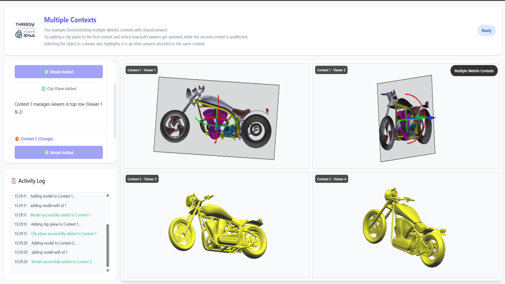

# Multiple Contexts

## Overview

This example demonstrates how to create and manage multiple WebVis contexts within a single application, each with their own viewers and independent state. Learn how contexts isolate 3D scenes and how changes in one context don't affect others, while viewers within the same context remain synchronized.

## Key Features Demonstrated

- **Multiple Context Management**: Creating and managing separate WebVis contexts
- **Context Isolation**: How different contexts maintain independent state
- **Viewer-Context Relationship**: Multiple viewers sharing the same context
- **Independent Scene State**: Models and modifications isolated per context
- **Clip Plane Isolation**: Clip planes affecting only viewers in the same context
- **Canvas Organization**: Organizing multiple canvases with different contexts
- **Selective Synchronization**: Viewers sync within contexts but not across contexts
- **Context Architecture**: Understanding WebVis context-based architecture

## Getting Started

**Explore Context Isolation**:
   - **Add Model to Context 1**: Click "add model" in the first section to load a model in both viewers of Context 1
   - **Add Model to Context 2**: Click "add model" in the second section to independently load a model in Context 2
   - **Add Clip Plane**: After adding a model to Context 1, click "add clip plane" to see how it only affects Context 1's viewers
   - **Compare Contexts**: Notice how each context maintains its own independent state
   - **Navigate Independently**: Interact with viewers to see how camera movements are independent per viewer

## API Reference

This example uses the WebVis Context and Viewer APIs.  
See the official documentation for details:  
- [WebVis Context API](https://docs.threedy.io/latest/doc/webvis/interfaces/ContextAPI.html#contextapi)
- [WebVis Viewer API](https://docs.threedy.io/latest/doc/webvis/interfaces/ViewerAPI.html#viewerapi)
---

**Note**: This example uses the WebVis library hosted on our demo instance. For production use, replace the library URL with your own instant3Dhub installation.

