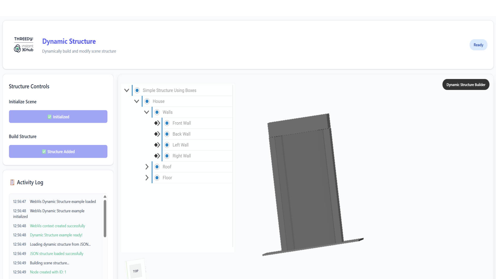

# Dynamic Structure Loading



## Overview

This example demonstrates how to dynamically load and build complex 3D structures from JSON configuration files. Learn how to programmatically create hierarchical node structures, apply transformations, set appearances, and manage parent-child relationships in WebVis using data-driven approaches.

## Key Features Demonstrated

- **JSON-Based Structure**: Loading 3D scene structure from external JSON files
- **Recursive Node Creation**: Building hierarchical structures with parent-child relationships
- **Dynamic Property Setting**: Applying transformations, labels, and appearances programmatically
- **Data-Driven Architecture**: Separating 3D structure definition from application code

## Getting Started

**Load Dynamic Structure**:
   - **Click "Load Dynamic Structure"** to fetch and build the 3D structure from JSON
   - **Observe Loading**: Watch as the button changes to "Loading..." then "Structure Loaded"
   - **Explore Structure**: Navigate around the loaded 3D structure
   - **Inspect Console**: Check browser console for loading progress and any errors

## JSON Structure Format

The example uses a JSON file (`simple_struct.json`) with the following structure:
```json
{
  "root": "nodeId",
  "nodes": {
    "nodeId": {
      "url": "urn:x-i3d:shape:box",
      "localTransform": [...],
      "label": "Node Label",
      "appearanceURI": "...",
      "children": ["childId1", "childId2"]
    }
  }
}
```

## Technical Configuration

- **WebVis Source**: The example uses the demo instance at `https://demo.threedy.io/repo/webvis/webvis.js?next`
- **Custom Configuration**: To use your own instant3Dhub installation, update the script source in `index.html`:
  ```html
  <script src="YOUR_HUB_INSTANCE/repo/webvis/webvis.js"></script>
  ```
## API Reference

This example uses the WebVis Context, Viewer and Instance Graph APIs.  
See the official documentation for details:  
- [WebVis Context API](https://docs.threedy.io/latest/doc/webvis/interfaces/ContextAPI.html#contextapi)
- [WebVis Viewer API](https://docs.threedy.io/latest/doc/webvis/interfaces/ViewerAPI.html#viewerapi)
- [WebVis Instance Graph API](https://docs.threedy.io/latest/doc/webvis/interfaces/InstanceGraphAPI.html#instancegraphapi)
---

**Note**: This example uses the WebVis library hosted on our demo instance. For production use, replace the library URL with your own instant3Dhub installation.
