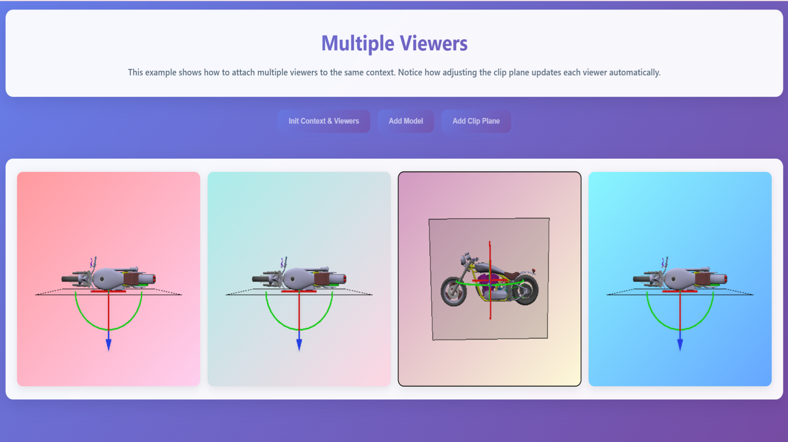

# Multiple Viewers

**🌐 [View Live Example](https://threedy-io.github.io/basic-webvis-examples/core-resources/viewer/multiple-viewers/)**

## Overview

This example demonstrates how to create multiple WebVis viewers that share the same context, showcasing the fundamental relationship between contexts and viewers. Learn how changes to one viewer automatically propagate to all other viewers sharing the same context, enabling synchronized visualization across multiple viewports.

## Key Features Demonstrated

- **Multiple Canvas Integration**: Creating viewers in regular HTML canvas elements
- **Shared Context Architecture**: Multiple viewers sharing a single WebVis context
- **Synchronized Updates**: Changes in one viewer automatically reflect in all others
- **Interactive Model Loading**: Step-by-step model loading and viewer initialization
- **Clip Plane Synchronization**: Clip planes affecting all viewers in the same context
- **Context Management**: Proper context creation and viewer attachment

## Getting Started

**Interact with Multiple Viewers**:

- **Click "init context & viewers"** to initialize the WebVis context and create four viewers
- **Click "add model"** to load a 3D model that appears in all viewers
- **Click "add clip plane"** to add a clipping plane that affects all viewers simultaneously
- **Navigate** in any viewer to see how camera movements are independent per viewer
- **Observe** how the clip plane and model state are shared across all viewers

## API Reference

This example uses the WebVis Context and Viewer APIs.  
See the official documentation for details:

- [WebVis Context API](https://docs.threedy.io/latest/doc/webvis/interfaces/ContextAPI.html#contextapi)
- [WebVis Viewer API](https://docs.threedy.io/latest/doc/webvis/interfaces/ViewerAPI.html#viewerapi)

---

**Note**: This example uses the WebVis library hosted on our demo instance. For production use, replace the library URL with your own instant3Dhub installation.
