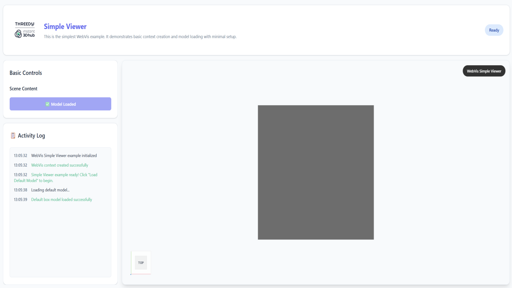

# Simple WebVis Viewer

## Overview

This example demonstrates the most basic WebVis implementation - a clean, minimalistic 3D viewer with a simple cube model. Perfect for getting started with WebVis or understanding the fundamental setup required for any WebVis application.

## Key Features Demonstrated

- **Getting Started**: Perfect entry point for WebVis development
- **Basic Model Loading**: Loading a primitive 3D shape (cube)
- **WebVis Component**: Using the `<webvis-viewer>` HTML component
- **Context Management**: Basic context creation and model enabling
- **Essential API**: Core WebVis API usage patterns

## Getting Started

**Interact with the Viewer**:

- **Rotate**: Click and drag to rotate the camera around the cube
- **Zoom**: Use mouse wheel to zoom in and out
- **Pan**: Right-click and drag to pan the camera
- **Observe**: Study the minimal code implementation in the source files

### Key WebVis Integration Points

1. **Context Setup** (`init()` function):

    - Component selection: `document.querySelector('webvis-viewer')`
    - Context request: `webvisComponent.requestContext()`

2. **Model Operations** (`loadModel()` function):
    - Adding models: `webvisContext.add()`
    - Setting properties: `webvisContext.setProperty()`

## Use Cases

- **Learning WebVis**: First example for WebVis newcomers
- **Basic Template**: Starting point for new WebVis projects
- **Integration Testing**: Quick setup for testing WebVis integration
- **Documentation**: Reference for minimal WebVis implementation

## API Reference

This example uses the WebVis Context.  
See the official documentation for details:

- [WebVis Context API](https://docs.threedy.io/latest/doc/webvis/interfaces/ContextAPI.html#contextapi)

---

**Note**: This example uses the WebVis library hosted on our demo instance. For production use, replace the library URL with your own instant3Dhub installation.
