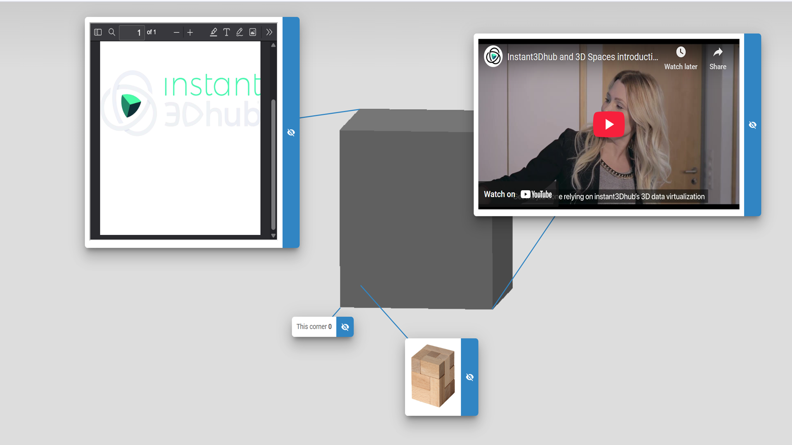

# Advanced HTML Annotations

## Purpose

This example demonstrates advanced usage of the WebVis Annotation API, showing how to create rich HTML content within annotations including images, formatted text, links, and interactive elements.

## Key Features Demonstrated

- **Rich HTML Content**: Complex HTML structures within annotations
- **Image Integration**: Embedding images in annotations
- **Interactive Elements**: Clickable links and buttons within annotations
- **Dynamic Content**: Programmatically updating annotation content

## Getting Started
**Interact with Annotations**:
   - **Click** on the 3D model to place new annotations
   - **Rotate** the view to see annotations maintain 3D positioning
   - **Zoom** in/out to observe annotation scaling behavior

## API Reference

This example uses the WebVis Context, Viewer and Annotation APIs.  
See the official documentation for details:  
- [WebVis Context API](https://docs.threedy.io/latest/doc/webvis/interfaces/ContextAPI.html#contextapi)
- [WebVis Viewer API](https://docs.threedy.io/latest/doc/webvis/interfaces/ViewerAPI.html#viewerapi)
- [WebVis Annotation API](https://docs.threedy.io/latest/doc/webvis/interfaces/AnnotationAPI.html#annotationapi)

---

**Note**: This example uses the WebVis library hosted on our demo instance. For production use, replace the library URL with your own instant3Dhub installation.
