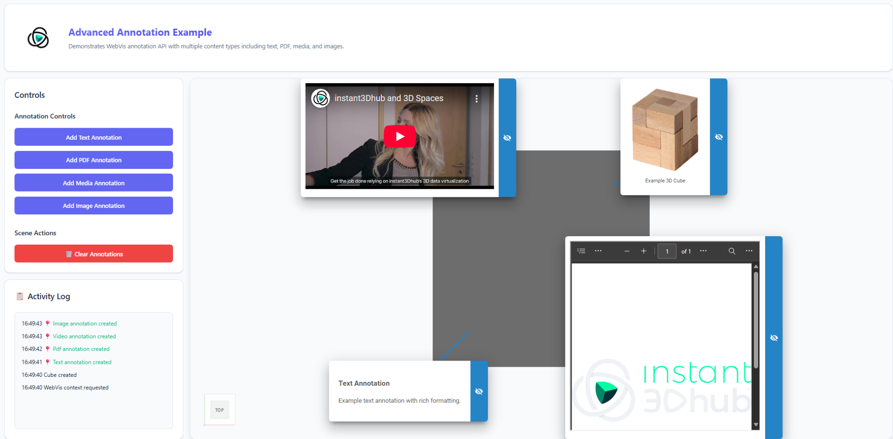

# Advanced HTML Annotations

## Overview

This example demonstrates advanced usage of the WebVis Annotation API with rich HTML content types. Create annotations with formatted text, embedded PDFs, images, and video content positioned at the corners of a 3D cube model.

## Key Features Demonstrated

- **Multiple Content Types** - Text, PDF, image, and video annotations
- **Rich HTML Content** - Complex HTML structures with styling and formatting
- **Media Integration** - Embedded PDFs, images, and YouTube videos
- **Predefined Positioning** - Annotations placed at cube corner positions
- **Bulk Operations** - Clear all annotations with a single action

## Getting Started

1. **Add Text Annotation** - Create a formatted text annotation with rich HTML
2. **Add PDF Annotation** - Embed a PDF document in an iframe annotation
3. **Add Media Annotation** - Embed a YouTube video in the annotation
4. **Add Image Annotation** - Display an image with caption in the annotation
5. **Clear Annotations** - Remove all annotations from the scene at once

## API Reference

This example uses the WebVis Context, Viewer and Annotation APIs.  
See the official documentation for details:

- [WebVis Context API](https://docs.threedy.io/latest/doc/webvis/interfaces/ContextAPI.html#contextapi)
- [WebVis Viewer API](https://docs.threedy.io/latest/doc/webvis/interfaces/ViewerAPI.html#viewerapi)
- [WebVis Annotation API](https://docs.threedy.io/latest/doc/webvis/interfaces/AnnotationAPI.html#annotationapi)

---

**Note**: This example uses the WebVis library hosted on our demo instance. For production use, replace the library URL with your own instant3Dhub installation.
