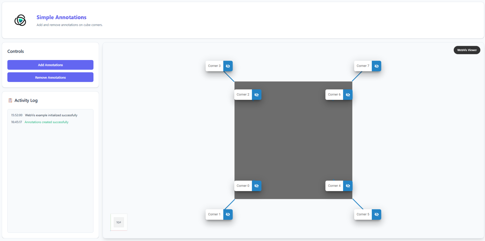

# Simple Annotations

## Overview

This example demonstrates basic WebVis annotation functionality by creating and removing simple text annotations at all 8 corners of a cube model. Perfect for learning the fundamentals of WebVis annotation API.

## Key Features Demonstrated

- **Bulk Annotation Creation** - Creates 8 numbered annotations at all cube corners
- **Simple Text Content** - Basic text annotations with corner numbering
- **Bulk Removal** - Remove all annotations with a single action
- **Activity Logging** - Real-time feedback for all operations
- **Clean Interface** - Two-button control system for easy interaction

## Getting Started

1. **Add Annotations** - Click "Add Annotations" to create 8 numbered corner annotations
2. **Remove Annotations** - Click "Remove Annotations" to clear all annotations from the scene
3. **Monitor Activity** - Watch the activity log for operation feedback
4. **Rotate View** - Navigate around to see annotations maintain their 3D positions

## API Reference

This example uses the WebVis Context, Viewer and Annotation APIs.  
See the official documentation for details:

- [WebVis Context API](https://docs.threedy.io/latest/doc/webvis/interfaces/ContextAPI.html#contextapi)
- [WebVis Viewer API](https://docs.threedy.io/latest/doc/webvis/interfaces/ViewerAPI.html#viewerapi)
- [WebVis Annotation API](https://docs.threedy.io/latest/doc/webvis/interfaces/AnnotationAPI.html#annotationapi)

---

**Note**: This example uses the WebVis library hosted on our demo instance. For production use, replace the library URL with your own instant3Dhub installation.
