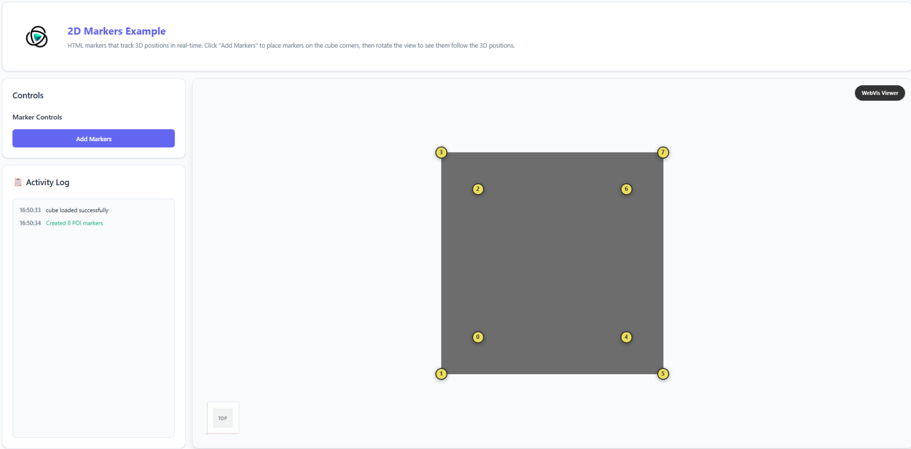

# 2D Markers

**🌐 [View Live Example](https://threedy-io.github.io/basic-webvis-examples/markup/point-of-interest/2d-markers/)**

## Overview

This example demonstrates how to create HTML markers that track 3D positions in real-time. Click a button to place 8 numbered markers at the corners of a cube, then watch them maintain their screen positions as you navigate around the 3D scene.

## Key Features Demonstrated

- **3D to 2D Projection** - Convert 3D world coordinates to 2D screen positions
- **Dynamic HTML Markers** - Create numbered span elements positioned over 3D points
- **Real-time Tracking** - Markers automatically update position during camera movement
- **View Synchronization** - WebVis viewer events trigger marker position updates
- **Simple Interaction** - Single button creates/replaces all 8 corner markers

## Getting Started

1. **Add Markers** - Click "Add Markers" to create 8 numbered markers at cube corners
2. **Rotate View** - Use mouse to rotate and see markers maintain their 3D positioning
3. **Zoom** - Mouse wheel zoom in/out to observe marker screen positioning behavior
4. **Pan** - Right-click drag to pan and watch markers follow cube corners

## API Reference

This example uses the WebVis Context and Viewer APIs.  
See the official documentation for details:

- [WebVis Context API](https://docs.threedy.io/latest/doc/webvis/interfaces/ContextAPI.html#contextapi)
- [WebVis Viewer API](https://docs.threedy.io/latest/doc/webvis/interfaces/ViewerAPI.html#viewerapi)

---

**Note**: This example uses the WebVis library hosted on our demo instance. For production use, replace the library URL with your own instant3Dhub installation.
