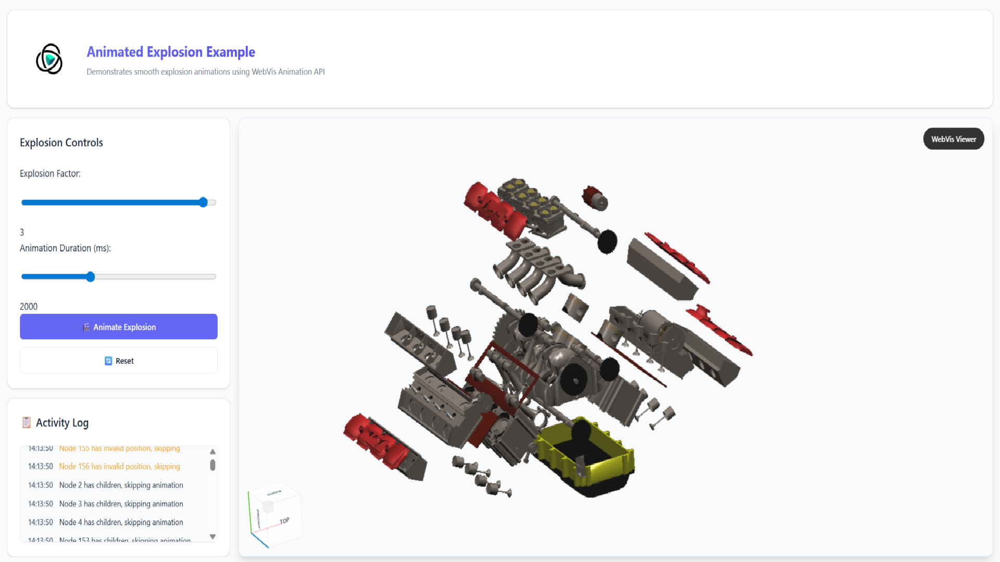

# Explosion Animation

## Overview

This example demonstrates how to create smooth, animated explosion effects using WebVis animation properties. It combines custom transformation calculations with WebVis animation capabilities to create visually appealing, time-based explosion sequences where parts smoothly move outward from the center over a configurable duration.

## Key Features Demonstrated

- **Animated Transformations**: Using WebVis animation properties to create smooth, time-based movement
- **Configurable Animation Duration**: Interactive control over explosion timing (500ms to 5000ms)
- **Leaf Node Targeting**: Intelligent selection of only leaf nodes (parts without children) for cleaner animations
- **Smooth Motion Interpolation**: WebVis handles the interpolation between start and end positions automatically

## Getting Started

**Interact with the Viewer**:

- **Rotate**: Click and drag to rotate the camera
- **Zoom**: Use mouse wheel to zoom in and out
- **Pan**: Right-click and drag to pan the camera

## Code Structure for Developers

This example includes clear markers to help developers identify WebVis-specific code:

### Finding WebVis API Calls

All WebVis API interactions are marked with `WEBVIS_API:` comments in the code. Search for this keyword to quickly locate:

- Context creation and management
- Model loading and manipulation
- Property settings and configurations
- All direct WebVis library calls

## API Reference

This example uses the WebVis Context.  
See the official documentation for details:

- [WebVis Context API](https://docs.threedy.io/latest/doc/webvis/interfaces/ContextAPI.html)
- [WebVis Viewer API](https://docs.threedy.io/latest/doc/webvis/interfaces/ViewerAPI.html)
- [WebVis Animation API](https://docs.threedy.io/latest/doc/webvis/interfaces/AnimationAPI.html)

---

**Note**: This example uses the WebVis library hosted on our demo instance. For production use, replace the library URL with your own instant3Dhub installation.
