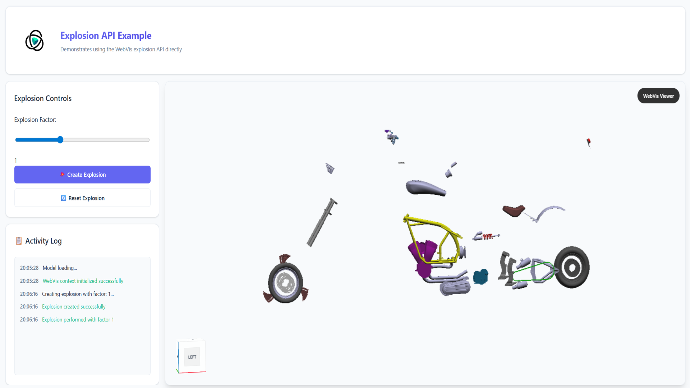

# Explosion API Example

## Overview

This example demonstrates how to use the WebVis explosion API directly to create explosion effects. It loads a 3D model and uses the built-in explosion functionality to move parts outward from the center of the model's bounding box.

## Key Features Demonstrated

- **Direct Explosion API Usage**: Using `createExplosion()`, `performExplosion()`, and `endExplosion()` methods
- **Dynamic Explosion Factor**: Interactive slider to control explosion intensity
- **Explosion State Management**: Proper handling of explosion creation and reset cycles

## Getting Started

**Interact with the Viewer**:

- **Rotate**: Click and drag to rotate the camera
- **Zoom**: Use mouse wheel to zoom in and out
- **Pan**: Right-click and drag to pan the camera

## Code Structure for Developers

This example includes clear markers to help developers identify WebVis-specific code:

### Finding WebVis API Calls

All WebVis API interactions are marked with `WEBVIS_API:` comments in the code. Search for this keyword to quickly locate:

- Context creation and management
- Model loading and manipulation
- Property settings and configurations
- All direct WebVis library calls

### Key WebVis Integration Points

1. **Context Setup** (`initializeExplosionExample()` function):

    - Component selection: `document.querySelector('webvis-viewer')`
    - Context request: `webvisComponent.requestContext()`

2. **Explosion API Operations**:

    - Creating explosion: `context.createExplosion(nodeId)`
    - Performing explosion: `context.performExplosion(explosionFactor)`
    - Ending explosion: `context.endExplosion()`

3. **Model Operations**:
    - Adding models: `context.add()`
    - View fitting: `viewer.fitViewToNode()`

## API Reference

This example uses the WebVis Context.  
See the official documentation for details:

- [WebVis Context API](https://docs.threedy.io/latest/doc/webvis/interfaces/ContextAPI.html)
- [WebVis Viewer API](https://docs.threedy.io/latest/doc/webvis/interfaces/ViewerAPI.html)
- [WebVis Explosion API](https://docs.threedy.io/latest/doc/webvis/interfaces/ExplosionAPI.html)

---

**Note**: This example uses the WebVis library hosted on our demo instance. For production use, replace the library URL with your own instant3Dhub installation.
