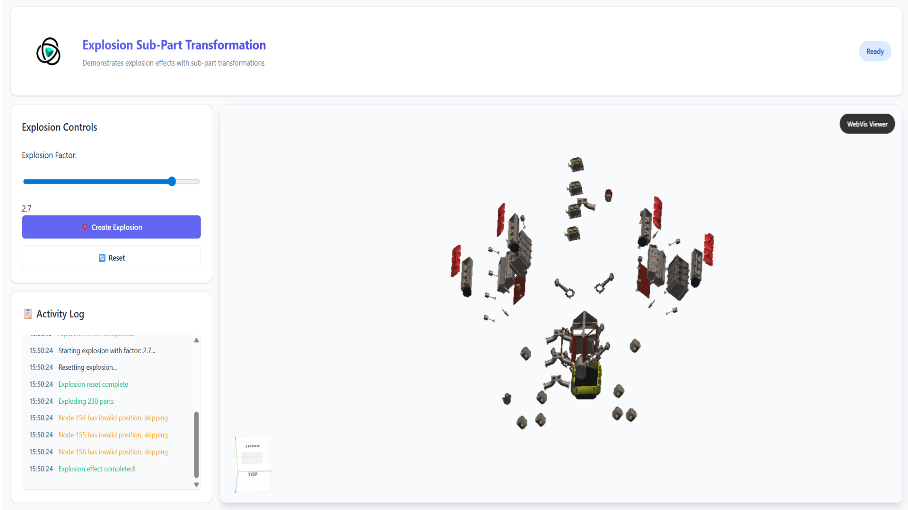

# Explosion Sub Part Transformation

## Overview

This example demonstrates how to create custom explosion effects by manually calculating and applying transformations to individual sub-parts of a 3D model. Unlike the built-in explosion API, this approach gives you full control over how each part moves during the explosion effect.

## Key Features Demonstrated

- **Manual Transformation Calculation**: Programmatically calculating explosion vectors from a central point
- **Recursive Node Traversal**: Finding and processing all descendant nodes in a model hierarchy
- **Matrix Manipulation**: Direct manipulation of local transformation matrices for precise positioning
- **Interactive Explosion Control**: Real-time adjustment of explosion intensity with visual feedback

## Getting Started

**Interact with the Viewer**:

- **Rotate**: Click and drag to rotate the camera
- **Zoom**: Use mouse wheel to zoom in and out
- **Pan**: Right-click and drag to pan the camera

## Code Structure for Developers

This example includes clear markers to help developers identify WebVis-specific code:

### Finding WebVis API Calls

All WebVis API interactions are marked with `WEBVIS_API:` comments in the code. Search for this keyword to quickly locate:

- Context creation and management
- Model loading and manipulation
- Property settings and configurations
- All direct WebVis library calls

### Key WebVis Integration Points

1. **Context Setup** (`initializeExplosionExample()` function):

    - Component selection: `document.querySelector('webvis-viewer')`
    - Context request: `webvisComponent.requestContext()`

2. **Model Operations**:

    - Adding models: `context.add()`
    - Getting properties: `context.getProperty()`
    - Setting properties: `context.setProperty()`
    - Resetting properties: `context.resetProperty()`

3. **Transformation Operations**:

    - Getting node volumes: `webvis.Property.GLOBAL_VOLUME`
    - Getting/setting local transforms: `webvis.Property.LOCAL_TRANSFORM`
    - Matrix manipulation for translation components (indices 12, 13, 14)

4. **Node Hierarchy Traversal**:
    - Getting children: `webvis.Property.CHILDREN`
    - Recursive node collection and validation

## API Reference

This example uses the WebVis Context.  
See the official documentation for details:

- [WebVis Context API](https://docs.threedy.io/latest/doc/webvis/interfaces/ContextAPI.html)
- [WebVis Viewer API](https://docs.threedy.io/latest/doc/webvis/interfaces/ViewerAPI.html)
- [WebVis Instance Graph API](https://docs.threedy.io/latest/doc/webvis/interfaces/InstanceGraphAPI.html)

---

**Note**: This example uses the WebVis library hosted on our demo instance. For production use, replace the library URL with your own instant3Dhub installation.
