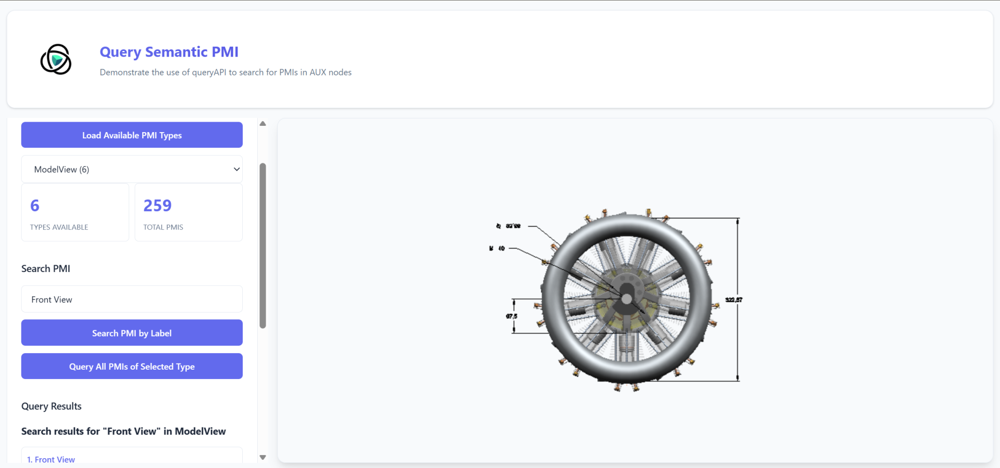

# Query Semantic PMI

This example demonstrates how to use the WebVis **queryAPI** to search for semantic PMI (Product Manufacturing Information) data stored in AUX nodes.



**🌐 [View Live Example](https://threedy-io.github.io/basic-webvis-examples/searching-and-filtering/query-api/query-semantic-pmi/)**

## Overview

Product Manufacturing Information (PMI) encompasses various types of metadata attached to 3D models, including dimensions, tolerances, surface finishes, notes, and more. This example shows how to:

## Key Features Demonstrated
- Retrieve all available PMI types from a loaded model
- Query PMIs by type using the queryAPI
- Search for specific PMI elements by label
- Display PMI metadata including nodeId and labels

## Getting Started
1. **Load a Model**: Ensure you have a model with PMI data loaded in the viewer
2. **Load PMI Types**: Click "Load Available PMI Types" to discover what PMI types are present
3. **Select Type**: Choose a PMI type from the dropdown
4. **Query or Search**:
    - Use "Query All PMIs of Selected Type" to retrieve all PMIs of that type
    - Enter a search term and use "Search PMI by Label" to find specific PMIs

## API Usage

### Query All PMIs of a Type

```javascript
const queryResult = await context.query({
    select: ['nodeId', 'metadata.auxProperties.label', 'metadata.auxProperties.pmiType'],
    conditions: [{ nodeType: 'aux' }, { metadata: 'auxProperties.pmiType', equals: 'ModelView' }],
});
```

### Search PMI by Label

```javascript
const queryResult = await context.query({
    select: ['nodeId', 'metadata.auxProperties.label'],
    conditions: [
        { nodeType: 'aux' },
        { metadata: 'auxProperties.pmiType', equals: 'ModelView' },
        { metadata: 'auxProperties.label', contains: 'Front' },
    ],
});
```

## Query Conditions

The queryAPI supports various condition types:

- **nodeType**: Filter by node type (e.g., "aux" for auxiliary nodes)
- **equals**: Exact match for metadata values
- **contains**: Partial match for string metadata values
- Multiple conditions are combined with AND logic

## Common PMI Types

Depending on your CAD source, you may find these PMI types:

- **ModelView**: Saved camera views with visibility states
- **Note**: Text annotations and callouts
- **Dimension**: Dimensional annotations
- **GeometricTolerance**: GD&T symbols and tolerances
- **SurfaceFinish**: Surface finish annotations
- **Weld**: Welding symbols
- **Datum**: Datum reference frames
- **ClippingPlane**: Section cuts and clipping planes


## Notes

- This example requires a model with PMI data to demonstrate functionality
- Some PMI types are filtered out by default (e.g., internal grouping types)
- The query results display nodeId, label, and type for each found PMI element
- All queries are performed on auxiliary (AUX) nodes where PMI data is stored

## API Reference

This example uses the WebVis Context, Viewer and Annotation APIs.  
See the official documentation for details:

- [WebVis Context API](https://docs.threedy.io/latest/doc/webvis/interfaces/ContextAPI.html)
- [WebVis Viewer API](https://docs.threedy.io/latest/doc/webvis/interfaces/ViewerAPI.html)
- [WebVis Query API](https://docs.threedy.io/latest/doc/webvis/interfaces/QueryAPI.html)


---

**Note**: This example uses the WebVis library hosted on our demo instance. For production use, replace the library URL with your own instant3Dhub installation.