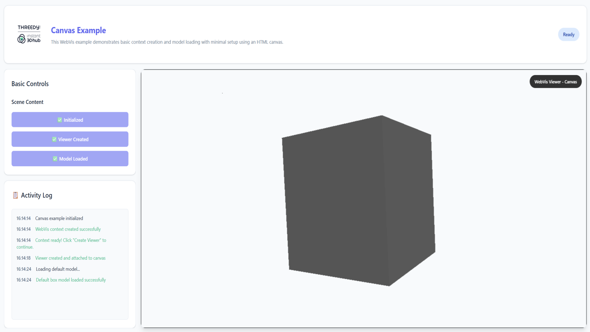

# Canvas Example

**🌐 [View Live Example](https://threedy-io.github.io/basic-webvis-examples/setup/context-viewer-canvas/)**

## Overview

This example demonstrates the fundamental WebVis Context and Viewer API, showing the step-by-step process of creating a context, attaching a viewer to a canvas, and loading a 3D model. Learn the core concepts of WebVis architecture and the relationship between contexts and viewers.

## Key Features Demonstrated

- **Context Creation**: Initialize a WebVis context programmatically
- **Viewer Setup**: Create and attach a viewer to an HTML canvas element
- **Model Loading**: Add and enable 3D models within the context
- **API Fundamentals**: Core WebVis API usage patterns
- **Canvas Integration**: Direct canvas element manipulation
- **Context Management**: Proper context lifecycle management

## Getting Started

**Follow the API Workflow**:

- **Click "initialize context"** to create a WebVis context
- **Click "create viewer"** to attach a viewer to the canvas
- **Click "add model"** to load and display a 3D model
- **Interact** with the 3D model using standard WebVis navigation controls

## API Reference

This example uses the WebVis Context and Viewer APIs.  
See the official documentation for details:

- [WebVis Context API](https://docs.threedy.io/latest/doc/webvis/interfaces/ContextAPI.html#contextapi)
- [WebVis Viewer API](https://docs.threedy.io/latest/doc/webvis/interfaces/ViewerAPI.html#viewerapi)

---

**Note**: This example uses the WebVis library hosted on our demo instance. For production use, replace the library URL with your own instant3Dhub installation.
