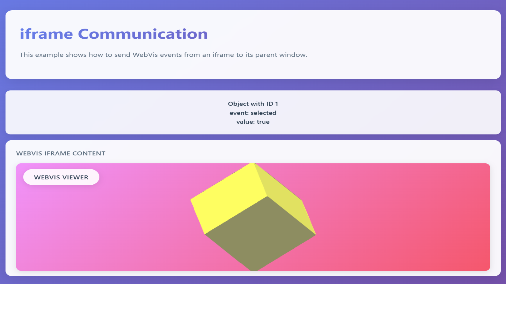

# iframe Integration



## Overview

This example demonstrates how to integrate WebVis viewers within HTML iframes and establish communication between the iframe and its parent window. Learn how to embed WebVis in isolated iframe environments while maintaining event communication and data exchange between the iframe and parent page.

## Key Features Demonstrated

- **iframe Embedding**: Loading WebVis viewer within an HTML iframe
- **Cross-Frame Communication**: Sending messages from iframe to parent window
- **Event Forwarding**: Capturing WebVis events and forwarding them to parent
- **Message Protocol**: Implementing custom message protocols for communication
- **Dynamic Content Updates**: Updating parent page content based on iframe events

## Getting Started
**Interact with iframe Communication**:
   - **View the Setup**: Notice the WebVis viewer loaded within the iframe
   - **Click on the Cube**: Click on the 3D model in the iframe
   - **Observe Communication**: See how event information appears in the parent window
   - **Monitor Console**: Check browser console for message communication logs

## Technical Configuration

- **WebVis Source**: The example uses the demo instance at `https://demo.threedy.io/repo/webvis/webvis.js?next`
- **Custom Configuration**: To use your own instant3Dhub installation, update the script source in `webvis.html` line 8:
  ```html
  <script src="YOUR_HUB_INSTANCE/repo/webvis/webvis.js"></script>
  ```
## API Reference

This example uses the WebVis Context API.  
See the official documentation for details:  
- [WebVis Context API](https://docs.threedy.io/latest/doc/webvis/interfaces/ContextAPI.html#contextapi)

---

**Note**: This example uses the WebVis library hosted on our demo instance. For production use, replace the library URL with your own instant3Dhub installation.
