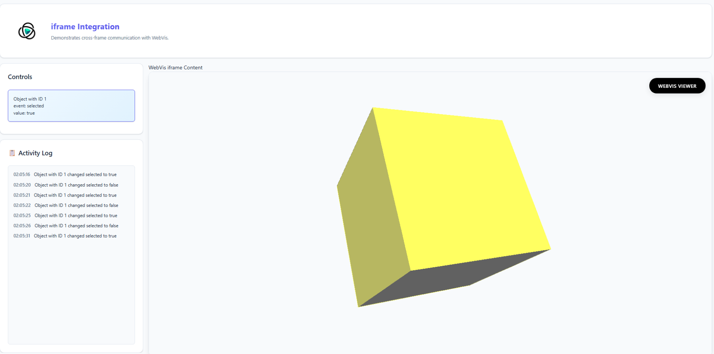

# iframe Integration

**🌐 [View Live Example](https://threedy-io.github.io/basic-webvis-examples/setup/iframe-integration/)**

## Overview

This example demonstrates WebVis integration within HTML iframes and cross-frame communication. A WebVis viewer runs inside an iframe with a simple cube model, and when you interact with the cube, events are forwarded to the parent window and displayed in real-time.

## Key Features Demonstrated

- **iframe Embedding** - WebVis viewer running inside an HTML iframe
- **Cross-Frame Communication** - postMessage API for iframe-to-parent communication
- **Event Forwarding** - WebVis NODE_CHANGED events sent from iframe to parent
- **Real-time Display** - Parent window updates output text and activity log
- **Simple Interaction** - Click on cube in iframe to trigger events

## Getting Started

1. **View Setup** - Notice the WebVis viewer with cube loaded in the iframe below
2. **Click Cube** - Click on the 3D cube model inside the iframe
3. **Observe Communication** - See event information appear in the Controls panel above
4. **Check Activity Log** - Monitor the activity log for detailed event messages
5. **Interact More** - Continue clicking to see additional event communications

## API Reference

This example uses the WebVis Context API.  
See the official documentation for details:

- [WebVis Context API](https://docs.threedy.io/latest/doc/webvis/interfaces/ContextAPI.html#contextapi)

---

**Note**: This example uses the WebVis library hosted on our demo instance. For production use, replace the library URL with your own instant3Dhub installation.
